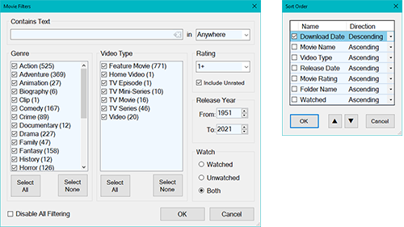

# A Video Librarian for All Your Movies

This is a standalone Windows app that will automatically download information for all
the videos in your video folders and present it to you in a searchable fashion
in order to select a video to watch. This app is designed to be viewed on your
TV via an HDMI connection (or other means) to your laptop (e.g. larger fonts).

*Note: All this information is also available in the application about box.*

## Prerequisites

VideoLibrarian uses .NET 4.5. If you are using Windows 7 or earlier, then you must first install .NET 4.5. If you attempt to run this utility and .NET 4.5 is NOT installed, this application will fail to run.

You may download and install .NET 4.5 from:  
<http://www.microsoft.com/en-us/download/details.aspx?id=30653>

## Installation

Copy VideoLibrarian.exe to any new or existing writable directory.
Copy the optional companion utilities VideoOrganizer.exe and VideoValidator.exe to the same folder.
That's it!

Upon execution, VideoLibrarian.exe will create additional files in the same
directory as the executable.

-   **VideoLibrarian.log** – Text file contains status messages. It may be
    informational, warnings, and errors.
-   **VideoLibrarian.SavedState.xml** – This file contains all the current configuration
    values.
-   **NReco.VideoInfo.dll** – Used to extract information from the video file.
-   **ffprobe.exe** – Used to extract information from the video file.

Note: Upon first run, Norton Antivirus (or any other AV app) may block VideoLibrarian and VideoOrganizer for suspicious activity as they both query IMDB.com for movie info. Be sure to allow these within your antivirus app. Malicious hackers make it so difficult these days...

## Video Folder Setup

Within your root video folder, each movie/episode video must be in a separate
folder with a matching IMDB movie shortcut (.url). A TV series root
folder contains only the main IMDB TV series shortcut as it just refers to all
the episodes. The folders may be arranged in any way you see fit so long as the
full directory path (not filenames) does not exceed 245 characters (This is a Windows limitation). Any
additional files in these folders are ignored. Upon startup, this application
will add additional cache files to these folders. See File-\>Status Log for details.

As an example, your folders may be arranged as follows:
```
    videosRoot
    ├── video1
    │   ├── anyname.mp4 – The video file. May be any video format.
    │   └── anyname.url – The IMDB movie shortcut.
    ├── video2
    ├── videoN
    ├── tvSeries1
    │   ├── anyname.url – The IMDB movie shortcut.
    │   ├── episode1
    │   │   ├── anyname.mp4 – The video file. May be any video format.
    │   │   └── anyname.url – The IMDB movie shortcut.
    │   ├── episode2
    │   └── episodeN
    ├── tvSeries2
    └── tvSeriesN
```

### Semi-automatic Video Layout Configurator
The utility *VideoOrganizer.exe* may be used to set up the movie and TV series folders for you. 
It is not perfect because it attempts to discern the true movie name from the video file name and may occasionally get it wrong.
VideoOrganizer.exe must reside in the same folder as *VideoLibrarian.exe*. 
VideoOrganizer.exe will automatically create or update the video folder tree described above. It also includes a movie information editor to customize the information retrieved from IMDB.
Click on *About* for additional documentation on how to use it.

### Video Anti-Corruption Verification
Because hard drives are not infallible, video files may get corrupted over time. *VideoValidator.exe* will go through all your VideoLibrarian videos and validate that they are not corrupted. It does not fix them but it does help you identify them. *VideoValidator.exe* is a console application. Run the application with the '/?' argument to get a more comprehensive description regarding usage.

### Generated Cache Files
These cache files reside in the same folders as the shortcut files. They are 
unique to each shortcut.
- tt1234567.htm – downloaded IMDB web page.
- tt1234567.jpg – downloaded movie poster.
- tt1234567.xml – extracted movie information.
- tt1234567S.png – cached UI movie information tile.
- tt1234567M.png – cached UI movie information tile.
- tt1234567L.png – cached UI movie information tile.

If any of these files are deleted, they will be recreated.

### Manually Retrieving IMDB Movie Internet Shortcut

If one does not use VideoOrganizer or VideoOrganizer fails to identify the movie, 
the shortcut must be manually retrieved from IMDB.

Go to <https://www.imdb.com/find?s=tt>

In the web page search box, enter the name of the movie. The results may find
more than one entry. Verify by opening the relevant page. Click and drag the
link from the browser address bar to the folder with the matching movie.

### First Time VideoLibrarian Startup

When starting VideoLibrarian for the first time, the root folder(s) containing the
videos has not yet been set in VideoLibrarian.

Open the File-\>Settings dialog to enter your root video folders (you may have
more than one root video folder).

When OK is pressed, the movie information will start to be downloaded from the
internet. Depending on the number of movies you have, this may take from minutes
to hours. *Be patient*. This cached information for each movie is stored in the
same folder as the video. These files are named tt1234567.xxx. If these files
are deleted, they will automatically be regenerated. Once these cached files
have been generated, startup will be a whole lot faster. This is the only time
the internet is accessed.

Review File-\>Status Log or the VideoLibrarian.log for any possible errors in file
generation.

### Movie Tile View Modes

Each UI movie information item is called a ‘tile’. These tiles just fill the
window, wrapping from left to right.

The tiles come in 3 sizes, small, medium, and large. ‘Large’ displays all the
information available, and ‘Small’ contains a subset because all the information
will not fit. However, many more small tiles will fit on a single page than large
tiles. That is the trade-off.

### Adding/Changing/Removing/Reorganizing Movies

Because VideoLibrarian is based directly on the files within the folders, the video folders may be added, moved, renamed, or deleted at any time without any ill effect. This is the added management flexibility at the cost of some startup performance. For restart performance, a database _could_ have been used but it would have created a lot of restrictions regarding file management and a lot of problems maintaining synchronization between the database and actual movies. I opted for ease-of-use versus a small increase in startup speed.

### Manually Changing/Correcting Movie Information

The movie information is all stored in the xml file, tt1234567.xml. Most of the elements are descriptive and can be changed as necessary. If you make any changes, you must delete the tt\*.png cache files so these files can be regenerated with your new changes. If you do not want to manually edit this xml file, use _VideoOrganizer.exe_. It will allow you to safely update the  file without fear of corrupting it.

#### Changing the Default Movie Poster Image

When this application gathers the information from the url shortcut you
specified, it downloads the first poster image it finds. This image may not be
the best poster image. The IMDB movie page actually has many poster images (some
in foreign languages). You can manually download a poster image from IMDB or
elsewhere and replace the one that VideoLibrarian downloaded. If you do, you must
delete the tt\*.png cache files so they can be regenerated with your new image
embedded. Also for backup, you should also update the poster url in the XML
file. The ideal image ratio is 250x365 pixels. Larger images are better so they
can be scaled without any loss of image quality.

##### Special notes:
If element *EpisodeCount* is greater than zero, the movie information refers to a
TV series. A video in this folder is ignored. Child episode subfolders contain
the video files.

If element *Season* is greater than zero, the movie information refers to a TV
series episode.

Element *Episode* may be any integer but must be unique within the series.

The episode *MovieName* element consists of 2 parts, the series name and episode name <small>(ex. \<*MovieName*\>Eureka - Pilot\</*MovieName*\>)</small>. 
The two names are delimited by a soft hyphen (" \\xAD ", with spaces), _not_ a regular
minus-hyphen ‘-‘ character. They look alike. If necessary, just copy the ‘dash’ from another
episode. This was done to distinguish between regular dashes as part of the movie or
episode names.

### Features

-   Multiple root media folders may be defined. Available through menu
    File-\>Settings…

-   Automatically downloads missing movie information from the internet and caches 
    it for faster startup.

-   Error/status text log. Available through menu File-\>Status Log…

-   3 different video info item (aka UI ‘tile’) sizes. Available through menu
    View.

-   Sort tiles by multiple properties.

-   Filter tiles by multiple properties.

-   Maximum supported videos is 3200. Additional videos are ignored. See log for
    details. Note that each entire TV-Series count as one ‘movie’.

-   Scrolling is supported by clicking and dragging on the scrollbar, mouse
    wheel, and keyboard arrow keys, Home, End, PageUp, PageDown and Alt-arrow
    keys. Arrow keys scroll by 1/10 height (or width) of the current tile.
    Alt-arrow keys scroll by 1 pixel.

-   Clicking on title opens the video in your video player (as defined in File->Settings).

-   Clicking on the description (or small tile body), opens the full summary in
    a popup window.

-   Clicking on the location opens containing folder in Windows Explorer.

-   Clicking on the “IMDB” icon, opens the IMDB movie page in your browser (as defined in File->Settings).

-   Clicking on the “Watched” checkbox, marks the video as ‘previously viewed’
    and also shows date viewed. One can also filter and sort on this property.

-   Clicking on the poster will blow up the tile so it fits the full screen
    (Large tiles only). Click anywhere on the full screen image exits the
    fullscreen mode. Useful when sitting on the couch.

### Screenshots


  
Filter dialog values are computed from the enumerated videos. Sorting may be performed using multiple keys.

### Recommended Tools

These are 3rd party tools that enhance the video management experience. They are
not required, but they are sure helpful.

#### Video Player

In short, any video player will do. However, if you want a better viewing
experience, VideoLAN VLC video player supports all video formats and is open
source freeware actively supported by the VideoLAN community. See:
<https://www.videolan.org/>

#### Windows Explorer Video Properties Extension

When it comes to video properties, Windows Explorer only supports a handful of
video formats. Most notably, it *doesn’t*  support the popular mkv format!
Icaros Shell Extensions (freeware) will support nearly all video and audio
formats not supported by Windows Explorer. See:
<https://www.videohelp.com/software/Icaros>

#### Video Conversion

Invariably, movie videos are extremely large. With the right tool, one can
compress a video by 50% without any noticeable differences. There are many video
conversion tools out there. Good (and not so good) tools cost money, but the
best one that does not require you to be a video expert is the Divx Video
Converter (freeware). It may be found at
<https://www.divx.com/en/software/divx>. It includes a video player but it is
not as flexible or comprehensive as the VLC video player.

If you run into conversion problems, K-Lite Codec Pack contains the most 
comprehensive set of codecs <http://www.codecguide.com/download_kl.htm> 

#### Video Properties Viewer

The popular MediaInfo viewer displays *all* the info/properties in any video or
audio file. See: <https://mediaarea.net/en/MediaInfo>.

#### MKV Properties Editor

MKVToolNix allows one to add/remove/edit properties and components of a video
and save it as an MKV format. It does not perform any video conversion. Most
other video formats do not have editable properties. That’s why the MKV video
container format is so popular. See: <https://mkvtoolnix.download>.

### Developer

With the following exceptions, no 3rd-party source code was used. It was entirely 
hand-crafted and optimized. It was developed entirely within .Net Framework 4.5 
Forms on Visual Studio 2019.

#### 3rd Party Code

<https://www.codeproject.com/Articles/624997/Enhanced-Scrollbar>

This is used (and slightly modified) because VideoLibrarian is a gallery of tiles
that vastly exceeds the maximum size of the default virtual window. As a result,
the default windows scroll bars are woefully inadequate.

<https://www.nuget.org/packages/NReco.VideoInfo/>

This is used to extract media info directly from the video files. It is only 
used during movie information download.

#### Design Considerations

The UI design was inspired by [SimpleMovieCatalog](https://github.com/damienlangg/SimpleMovieCatalog) and various torrent servers.

##### Requirements
- Organize videos on computer by various properties (view, sort and filter).
- View on gallery on a TV via HDMI. Must be large enough to see from the couch but also small enough to view a number of them on a single screen. 
- Must support a LOT of videos (>1000) and be fast.
- Must consist of a single executable. No "installation".
- Properties must include things like name, description, genre, movie ratings, release date, etc.
- Must be able to retrieve this information from the internet by itself.
- Target audience is a normal computer user. Not a developer or computer expert.

##### High-level Design Choices
* As a web page/javascript? Requires many files. No robust means to gather properties. Not user-friendly installation. Subject to vagaries of browsers.
* Target OS? Microsoft Windows. Just because it is what I know and what my laptop runs.
* Client-Server (irrespective of language)? Again, not average-user-friendly, higher complexity, and lower maintainability. Does your average user really want a server running all the time?
* As a standalone app? Easy to run, just drop into folder and execute.
* Language
  + C++ - Workable, but unnecessary complexity and more difficult to maintain.
  + C# - Faster and easier to maintain. There are no performance bottlenecks that low-level C++ needs to overcome. Supporting Win7+. Natively supports requisite https and regex.
    - WinForms? Can support large number of gallery items.
    - WPF? Gallery cannot support large number video tiles.
* Build Environment
  + .NET Core - Must include requisite .NET assemblies with installation. Ugh!
  + .NET Framework - .NET 4.5 must be installed on Win 7. Already included on Win 8 and Win 10. May create monolithic executable. Our goal.
  
Resulting decision - .net Framework Winforms

##### Low-level Design
* Enumerate folder tree by IMDB shortcuts (not movies). 
  + TV Series folder does not have a video even though episode folders do.
  + Folders bracketed by '!' are ignored. Useful for unformatted folders that may have IMDB shortcuts for other purposes. 
  + Shortcuts in the root folders are ignored.
  + IMDB shortcuts are the definitive files needed to retrieve and cache the movie properties. Video file names cannot be reliably parsed and used to find the movie on IMDB. See *VideoOrganizer.exe*. 
* Created custom FlowLayoutPanel because winforms built-in FlowLayoutPanel control is not designed for galleries.
  + Does not support virtual windows > 32768 pixels because Win32 scrollbars do not support scrolling > 32768.
  + Does not support child panels (e.g. tiles)
  + Does not support large number of controls (very very slow).
* Cannot have large number of repeating panels with many controls (gallery) due to limited limited number of windows handles (an OS resource) allowed per application. For efficiency, created panels/tiles consisting of background image containing no more than 2 real controls. As a result, VideoLibrarian can support up to 3200 movies (TV Series count as one movie).
  


